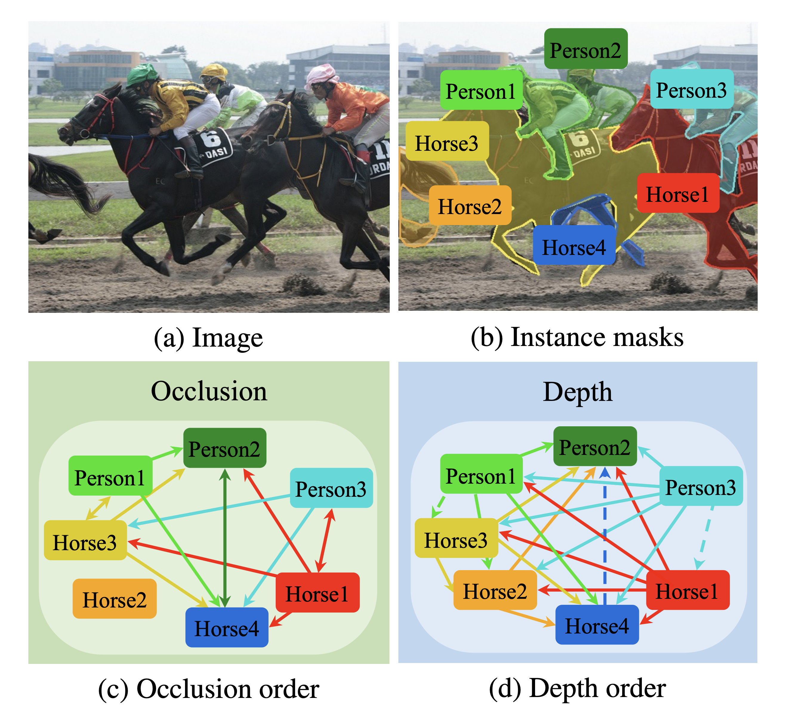

# Instance-wise Occlusion and Depth Orders in Natural Scenes (CVPR 2022)

InstaOrder is a new dataset that provides 2.9M annotations of geometric orderings for class-labeled instances in 101K natural scenes. InstaOrder is the first dataset of both occlusion order and depth order from the same image, with bidirectional occlusion order and delicate depth range annotations. 



## Installation
This code has been developed under Anaconda(Python 3.6), Pytorch 1.7.1, torchvision 0.8.2 and CUDA 10.1. Please install following environments:

  
```bash
# build conda environment
conda create --name order python=3.6
conda activate order

# install requirements
pip install -r requirements.txt

# install COCO API
pip install 'git+https://github.com/cocodataset/cocoapi.git#subdirectory=PythonAPI'
```

## Visualization
Check `InstaOrder_vis.ipynb` to visualize InstaOrder dataset including instance masks, occlusion order, and depth order.

## Training
The `experiments` folder contains train and test scripts of experiments demonstrated in the paper. 

To train {MODEL} with {DATASET},
1. Download ```{DATASET}``` following [this](#Datasets).
2. Set ```${base_dir}``` correctly in ```experiments/{DATASET}/{MODEL}/config.yaml```
3. (Optional) To train InstaDepthNet, download MiDaS-v2.1 [model-f6b98070.pt](https://github.com/intel-isl/MiDaS/releases/download/v2_1/model-f6b98070.pt) under ```${base_dir}/data/out/InstaOrder_ckpt```
4. Run the script file as follow:
    ```bash
    sh experiments/{DATASET}/{MODEL}/train.sh

    # Example of training InstaOrderNet^o (Table3 in the main paper) from the scratch
    sh experiments/InstaOrder/InstaOrderNet_o/train.sh
    ```


## Inference
1. Download pretrained models [InstaOrder_ckpt.zip](https://drive.google.com/file/d/1_GEmCmofLSkJZnidfp4vsQb2Nqq5aqBU/view?usp=sharing) (3.5G) and unzip files following the below structure. Pretrained models are named by ```{DATASET}_{MODEL}.pth.tar```

    ```
    ${base_dir}
    |--data
    |    |--out
    |    |    |--InstaOrder_ckpt
    |    |    |    |--COCOA_InstaOrderNet_o.pth.tar
    |    |    |    |--COCOA_OrderNet.pth.tar
    |    |    |    |--COCOA_pcnet_m.pth.tar
    |    |    |    |--InstaOrder_InstaDepthNet_d.pth.tar
    |    |    |    |--InstaOrder_InstaDepthNet_od.pth.tar
    |    |    |    |--InstaOrder_InstaOrderNet_d.pth.tar
    |    |    |    |--InstaOrder_InstaOrderNet_o.pth.tar
    |    |    |    |--InstaOrder_InstaOrderNet_od.pth.tar
    |    |    |    |--InstaOrder_OrderNet.pth.tar
    |    |    |    |--InstaOrder_OrderNet_ext.pth.tar  
    |    |    |    |--InstaOrder_pcnet_m.pth.tar
    |    |    |    |--KINS_InstaOrderNet_o.pth.tar
    |    |    |    |--KINS_OrderNet.pth.tar
    |    |    |    |--KINS_pcnet_m.pth.tar
    ```
2. (Optional) To test InstaDepthNet, download MiDaS-v2.1 [model-f6b98070.pt](https://github.com/intel-isl/MiDaS/releases/download/v2_1/model-f6b98070.pt) under ```${base_dir}/data/out/InstaOrder_ckpt```

3. Set ```${base_dir}``` correctly in ```experiments/{DATASET}/{MODEL}/config.yaml```


3. To test {MODEL} with {DATASET}, run the script file as follow:
     ```bash
    sh experiments/{DATASET}/{MODEL}/test.sh

    # Example of reproducing the accuracy of InstaOrderNet^o (Table3 in the main paper)
    sh experiments/InstaOrder/InstaOrderNet_o/test.sh

   ```


## Datasets

### InstaOrder dataset
To use InstaOrder, download files following the below structure
  - [InstaOrder annotations (ours)](https://drive.google.com/file/d/1n4NxDBkxhnRNSKuB8TDGGFcSD83Zknlj/view?usp=sharing)
  - [COCO 2017 annotations](https://cocodataset.org/#download)
  - [COCO 2017 train, val images](https://cocodataset.org/#download)
    
  ```
  ${base_dir}
  |--data
  |    |--COCO
  |    |    |--train2017/
  |    |    |--val2017/
  |    |    |--annotations/
  |    |    |    |--instances_train2017.json
  |    |    |    |--instances_val2017.json
  |    |    |    |--InstaOrder_train2017.json
  |    |    |    |--InstaOrder_val2017.json    
  ```


### COCOA dataset
To use COCOA, download files following the below structure
  - [COCOA annotations](https://github.com/Wakeupbuddy/amodalAPI)
  - [COCO 2014 train, val images](https://cocodataset.org/#download)

  ```
  ${base_dir}
  |--data
  |    |--COCO
  |    |    |--train2014/
  |    |    |--val2014/
  |    |    |--annotations/
  |    |    |    |--COCO_amodal_train2014.json 
  |    |    |    |--COCO_amodal_val2014.json
  |    |    |    |--COCO_amodal_val2014.json

  ```

### KINS dataset
To use KINS, download files following the below structure
- [KINS dataset](https://github.com/qqlu/Amodal-Instance-Segmentation-through-KINS-Dataset)

```
${base_dir}
|--data
|    |--KINS
|    |    |--training/
|    |    |--testing/
|    |    |--instances_val.json
|    |    |--instances_train.json
  
```


### DIW dataset
To use DIW, download files following the below structure
- [DIW Dataset](http://www-personal.umich.edu/~wfchen/depth-in-the-wild/)

```
${base_dir}
|--data
|    |--DIW
|    |    |--DIW_test/
|    |    |--DIW_Annotations
|    |    |    |--DIW_test.csv   

```


## Citing InstaOrder

If you find this code/data useful in your research then please cite our [paper](https://arxiv.org/abs/2111.14562):
```
@inproceedings{lee2022instaorder,
  title={{Instance-wise Occlusion and Depth Orders in Natural Scenes}},
  author={Hyunmin Lee and Jaesik Park},
  booktitle={Proceedings of the {IEEE} Conference on Computer Vision and Pattern Recognition},
  year={2022}
}
```

  
## Acknowledgement
We have reffered to and borrowed the implementations from [Xiaohang Zhan](https://github.com/XiaohangZhan/deocclusion/)
